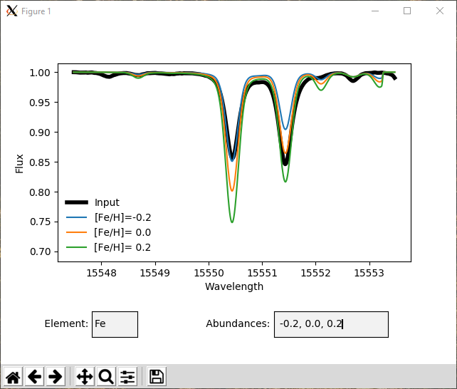

# Synthesis plotter
This little piece of software can plot synthetic spectra (generated on the fly with MOOG) on top of your input spectrum.

# Installation
This is a fairly standard scientific package and require normal packages. Just do the following:

```bash
$ pip install git+https://github.com/DanielAndreasen/MOOGly
$ pip install git+https://github.com/DanielAndreasen/synthesis-plotter
```
The first package is used to run and read MOOG.

Moreover, you will need to have `MOOGSILENT` in your `PATH`.

If the above installation is successfull you should now have a executable in your `PATH` called `plotter.py` (you may have to start a new terminal to see this).

# Example
To run you simply execute the script as:

```bash
$ plotter.py -i <input-spectrum> -l <linelist-for-MOOG> -a <atmosphere-model>
```

The input spectrum is assumed to be a text file with first column as wavelength and second column as normalized flux.

After you run the script you will see a plot like below (set the cursor in one of the boxes and hit enter).
Now you can change the element (only one element is possible) and the abundances (seperated with a comma), hit enter and see the updated plot.


## Getting started

There are some example files in the example folder to get you started. Enjoy!
